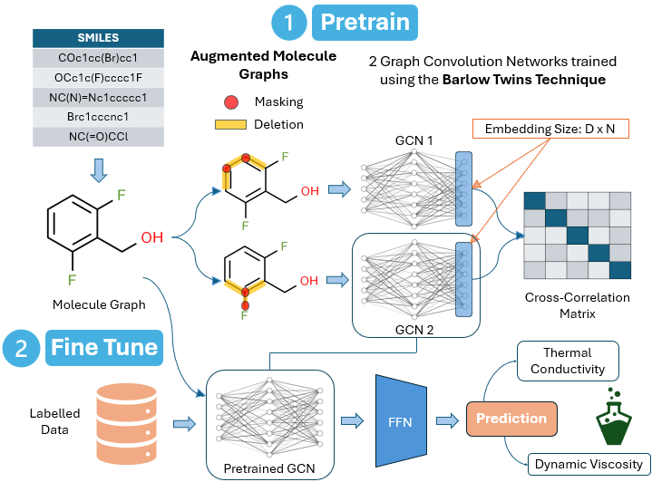

## Updated Approach: Molecular Barlow Twin Learning of Representations via Graph Neural Networks ##



The original implementation has been updated to use the augmentations for the molecules to train two models simultaneously using a Barlow Twin approach: [https://arxiv.org/abs/2103.03230]. The models can then be finetuned to predict the dynamic viscosity/thermal conductivity of thermal fluids. 

## Getting Started

### Installation

Set up conda environment and clone the github repo. The code has been tested on Ubuntu 24.04


- Create a new environment:
```
conda create -n molbtr python=3.11
```
```
conda activate molbtr
```
- Clone the source code of MolBTR:
```
git clone https://github.com/HariOmChadha/MolBTR.git
```
```
cd MolBTR
```
- Install dependencies:
```
pip install torch
pip install -r requirements.txt
```

### Dataset

The datasets used can be found in `GNN_BT_Data` folder. The splits are done using a specific set of indices to keep consistency. This can be changed in `dataset_test.py`.
`cond_data.csv`: contains the thermal conductivity values at 5 different temperatures for each molecule
`visc_data.csv`: contains the dynamic viscosity values at 5 different temperatures for each molecule
`visc_hc_data.csv`: this contains only hydrocarbons
`Smiles.csv`: contains around 16,000 SMILES strings

### Pre-training

To train the MolBTR, where the configurations and detailed explanation for each variable can be found in `config.yaml`

- Use the jupyter notebook called `main.ipynb`

To monitor the training via tensorboard, run `tensorboard --logdir ckpt/{PATH}` and click the URL http://127.0.0.1:6006/.

### Fine-tuning 

To fine-tune the MolBTR pre-trained model on downstream molecular benchmarks, where the configurations and detailed explaination for each variable can be found in `config_finetune.yaml`. IMPORTANT: Use the datasets in the format provided. Currently, can only finetune for Dynamic Viscosity and Thermal Conductivity. 

- Use the jupyter notebook called `main.ipynb` 


### Pre-trained models

We also provide pre-trained GCN models, which can be found in `ckpt/BT1` and `ckpt/BT2` respectively.
- BT1: 15% subgraph removed
- BT2: 15% subgraph removed + 20% nodes/edges masked

## Acknowledgements
- MolCLR Approach: [https://www.nature.com/articles/s42256-022-00447-x#code-availability](https://www.nature.com/articles/s42256-022-00447-x#code-availability)
- Barlow Twin Approach: [https://arxiv.org/abs/2103.03230](https://arxiv.org/abs/2103.03230)
- PyTorch implementation of SimCLR: [https://github.com/sthalles/SimCLR](https://github.com/sthalles/SimCLR)
- Strategies for Pre-training Graph Neural Networks: [https://github.com/snap-stanford/pretrain-gnns](https://github.com/snap-stanford/pretrain-gnns)
